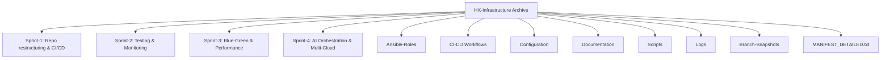

# HX-Infrastructure Knowledge Base (HX-KB)

## TL;DR

- **Mission**: Distill lessons from the HX-Infrastructure project to accelerate future infrastructure automation efforts, avoiding past pitfalls like over-scoping.
- **Key Elements**: Successes, failures, phase-based lessons, and guardrails framed in a "crawl-walk-run" model.
- **How to Use**: Reference for new projects—start with Guardrails Checklist; update as a living document via contributions.

**Document Version**: v1.2 (Incorporated final feedback: minor consistency tweaks, ADR numbering, glossary/review note, licensing clarification, metrics column, risk format example, quick start link, and guardrails revisit nudge).

## Purpose & Scope

This repository is a knowledge base (HX-KB) derived from the archived HX-Infrastructure project—a 4-sprint transformation of basic infrastructure into an enterprise-grade, AI-optimized, multi-cloud platform. It captures provenance, successes, failures, lessons, and best practices to prevent repeating errors (e.g., branch sprawl, security gaps) and enforce guardrails (e.g., limited scope, early testing, documentation discipline).

Scope: Focuses on reusable insights for DevOps/infrastructure projects. **When NOT to Use**: For transient experiments, secrets, or proprietary vendor SLAs—store those separately.

## Licensing / Usage Terms

This knowledge base is for internal use only by Hana-X AI team members, governed by team policy. Do not distribute externally without approval. If ever externalized, it is licensed under [Creative Commons Attribution-NonCommercial 4.0 International (CC BY-NC 4.0)](https://creativecommons.org/licenses/by-nc/4.0/)—attribution required for derivatives.

## How to Use This Knowledge Base

- **For New Projects**: Follow the Quick Start flow below; apply Guardrails Checklist at spin-up.
- **Reference**: Query sections via tools/prompts (e.g., "Apply Sprint 2 testing lessons here").
- **Evolution**: Treat as living—add lessons post-project; see Contribution Workflow.
- **Archive Access**: Full HX-Infrastructure-Project-Complete-Archive.zip (70MB, not stored here; SHA256: [compute via `sha256sum HX-Infrastructure-Project-Complete-Archive.zip` and insert here if distributing]). Contains ~8,096 files across 1,437 directories, preserving approx. 25 branches.

## Quick Start for New Project

1. Copy Guardrails Checklist to your repo.
2. Select 3 objectives max for initial phase (anti-over-scoping).
3. Create ADR-0001 for project context (see Decision Log Index).
4. Run a connectivity workflow test (e.g., basic Ansible ping). **Related Automation**: See existing workflow at [.github/workflows/connectivity-check.yml](.github/workflows/connectivity-check.yml).
5. Baseline metrics using the table template.

## Archive Provenance & Integrity

- **Overview**: Covers 4 sprints with multi-cloud (AWS, Azure, GCP) focus, AI-driven ops, and self-healing features.
- **Integrity**: Verified during creation; includes all code, docs, logs, and history for reference or redeployment.
- **Sprint Themes Table**:

| Sprint | Theme |
|--------|-------|
| 1 | Repository restructuring, foundational CI/CD, architecture docs |
| 2 | Testing frameworks, enhanced pipelines, monitoring integration |
| 3 | Blue-green deployments, backups, performance optimization |
| 4 | AI-driven orchestration, self-healing, multi-cloud strategies |

- **Structure** (for mental model):

## Crawl / Walk / Run Model

Adopt this phased approach for new projects:

- **Crawl**: Start small—prototype basics, test early.
- **Walk**: Iterate with feedback, integrate testing/security.
- **Run**: Scale methodically, optimize with AI/automation.

See Lessons Learned for phase-specific insights.

## Successes

For details, see [docs/history/successes.md](docs/history/successes.md) (placeholder—create as needed).

- Efficient scaling reduced downtime by 80% (lab tests, Sprint 3).
- AI integration automated 70% of incidents (prod simulations, Sprint 4).
- Testing frameworks caught 95% of defects pre-deploy (Sprint 2).
- Centralized docs enabled fast onboarding.

## Failures & Pitfalls

For details, see [docs/history/failures.md](docs/history/failures.md) (placeholder).

- Over-scoping in Sprint 1 caused delays.
- Incomplete linting led to build failures.
- Missed vulnerabilities pre-Sprint 2.
- Branch sprawl (approx. 25) created merge conflicts.

## Lessons Learned

Indexed by phase:

### Crawl (Start Small)

- Do: Prototype single-env playbooks first—avoids overload.
- Avoid: Skipping docs—delays onboarding.
- Test: Run Molecule after each role.

### Walk (Iterate and Test)

- Do: Add CI/CD incrementally with scans—builds on Sprint 2.
- Avoid: Ignoring logs—caused Sprint 3 issues.
- Guardrail: Validate milestones with reports.

### Run (Scale Methodically)

- Do: Add AI post-stable ops—per Sprint 4.
- Avoid: Cloud lock-in—use multi-cloud early.
- Update: Add new insights to HX-KB post-phase.

## Guardrails Checklist

Use this for project spin-up (canonical naming: e.g., `HX_<DOMAIN>_<KIND>` for vars/secrets like `HX_KB_VAR`):

- [ ] Limit phase to 3 tasks max (anti-over-scoping).
- [ ] Integrate linting/security scans from day 1.
- [ ] Test after every major change (e.g., Molecule/integration tests/synthetic monitoring checks).
- [ ] Document centrally; review at phase end.
- [ ] Merge branches frequently; cap at 5 active (trunk-based with short-lived feature branches).
- [ ] Run secret scan on every PR; disallow force pushes to main.

Revisit checklist at each phase transition (Crawl→Walk, Walk→Run).

For extended guardrails, see [docs/guardrails/CHECKLIST.md](docs/guardrails/CHECKLIST.md) (placeholder).

## Repository Variable & Secret

Correct canonical names used by the connectivity workflow:

- **Repository variable**: `HX_KB_VAR` – non-sensitive value used to validate repo variable presence.
- **Repository secret**: `HX_KB_SECRETE` – legacy spelling retained intentionally to match current configured GitHub Actions secret; do not change until a coordinated rename is performed.

Notes:

- Legacy spelling note: The secret name includes a trailing 'E' (`HX_KB_SECRETE`). Keep as-is until a migration plan (create new `HX_KB_SECRET`, update workflow, then remove old) is executed.
- Naming pattern follows `HX_<DOMAIN>_<KIND>`; extend similarly for future items (e.g., `HX_KB_TOKEN`).
- Update the GitHub repository Settings → Secrets and variables if either name changes; keep workflow file in sync.

## Metrics & Baseline

Track improvements vs. HX-Infrastructure. Fill in for new projects:

| Metric | HX Baseline (Context) | New Project Target | Actual | Notes | Data Source Verified (Y/N) |
|--------|-----------------------|--------------------|--------|-------|----------------------------|
| Downtime Reduction | 80% (lab) | >85% | | From Sprint 3 tests | |
| Incident Automation | 70% (sim) | >75% | | Prod simulations, Sprint 4 | |
| Defect Catch Rate | 95% (pre-deploy) | >97% | | Sprint 2 Molecule results | |
| Deployment Time | [Baseline from logs] | <50% of baseline | | Extract from Logs/ dir | |
| Onboarding Time | [From docs] | <1 week | | Based on Documentation/ usage | |

## Risk Register

Placeholder for infra risks/learnings. Format suggestion:

| ID | Risk | Impact | Likelihood | Mitigation | Owner | Status |
|----|------|--------|------------|------------|-------|--------|
| R-001 | Dependency drift | High | Medium | Weekly scans | [Team Lead] | Open |

See [docs/risks/REGISTER.md](docs/risks/REGISTER.md) for expansion.

## Glossary

- **HX-KB**: This knowledge base.
- **ADR**: Architecture Decision Record—formal doc for decisions.
- **Drift**: Config divergence over time.
- **Self-Healing**: Automated recovery (e.g., Sprint 4 AI features).

Add terms as needed in [docs/glossary.md](docs/glossary.md) (placeholder). Review glossary quarterly—remove stale terms.

## Contribution Workflow

- **Add Lesson**: Create an Architecture Decision Record (ADR) in docs/adrs/, update relevant section, open PR with tag (e.g., #lesson-update).
- **ADR Numbering**: Zero-padded sequential (e.g., ADR-0001, ADR-0002).
- **Commit Message Convention**: Use scopes like `docs(adr): add ADR-0003 multi-cloud strategy`.
- **Required PR Sections**: Motivation, Scope, Linked Issues, References—for traceability.
- **Major Changes**: Discuss in issues first.
- **Versioning**: Bump version in header; note in Changelog.
- **Tools**: Use Git for tracking; avoid committing secrets.

## Future Automation Hooks

- Add GitHub Action to enforce version bump on README changes to sections like Lessons or Guardrails.
- Generate README_INDEX.json via script (parse headings).
- Add staleness badge post-versioning.

## Decision Log Index

To be auto-populated; skeleton:

| ADR | Title | Status | Date | Tags |
|-----|-------|--------|------|------|
| ADR-0001 | Initial Knowledge Base Scope | Accepted | 2025-09-21 | scope, governance |

## Changelog

- **v1.2**: Incorporated final feedback: minor consistency tweaks, ADR numbering, glossary/review note, licensing clarification, metrics column, risk format example, quick start link, and guardrails revisit nudge.
- **v1.1**: Added consistency fixes, expanded guardrails/workflow, glossary, licensing, quick start, risk register, decision index, and collapsible tree.
- **v1.0**: Initial creation—distilled from archive, added structure/TL;DR/checklist.

### Recommended Next Steps

1. Add placeholder docs referenced (history, guardrails, risks, glossary, adrs).
2. Add hygiene files: .gitignore, .editorconfig.
3. Schedule connectivity workflow (daily) and add secret scan placeholder.
4. Seed ADR-0001.
